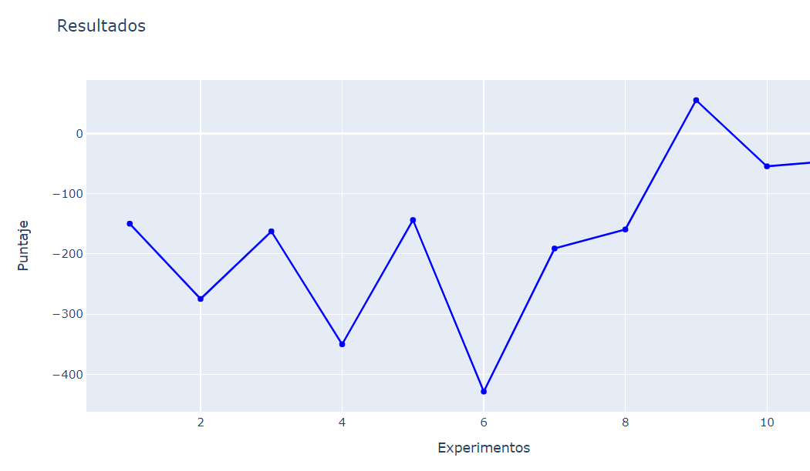

# DDQN-Lunar-Lander-v2
Aplicacion del algoritmo DDQN para el entorno de Open AI Lunar Lander

En el notebook DDQN Llander se muestra el codigo utlizado para los experimentos del proyecto. Asi mismo, en el archivo excel IA.xlsx se muestran los hiperparametros utlizados en cada experimento, asi como los resultados.

A continuacion se muestra una grafica con los resultados obtenidos hasta el momento.

Integrantes:

* Joan Conza  [@jncnza](https://github.com/jncnza/)
* David Freidenson
* Ramfis Centeno  [@RamfisCenteno](https://github.com/RamfisCenteno/)

